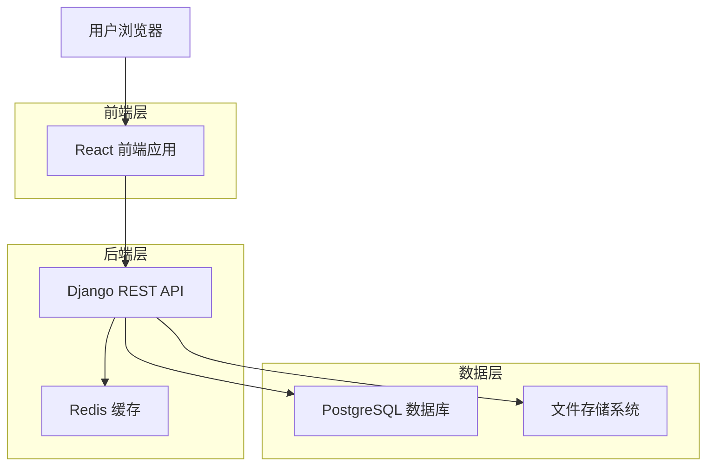
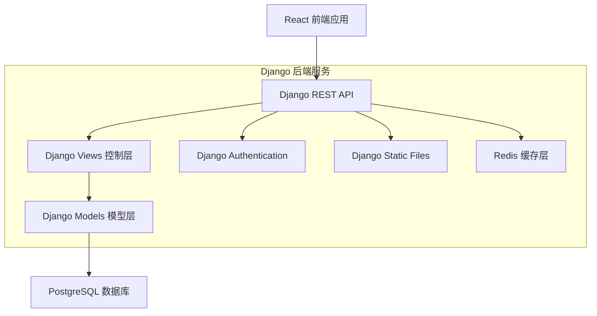
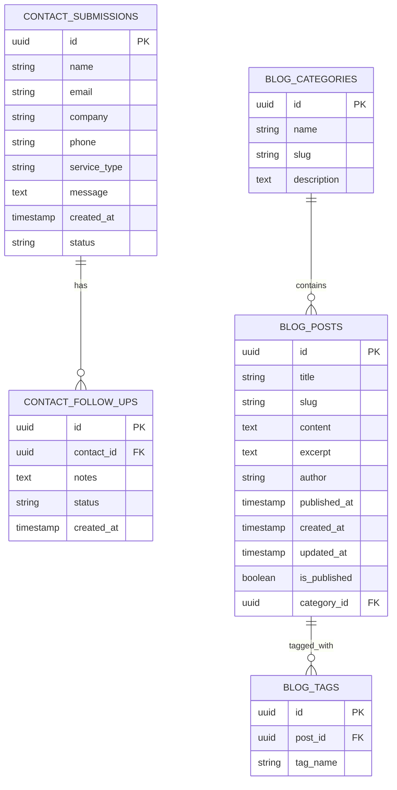

# 瑞比智慧 airabbi 企业官网技术架构文档

## 1. Architecture design



## 2. Technology Description

- Frontend: React@18 + TypeScript + Tailwind CSS@3 + Vite + React Router + Axios
- Backend: Django@4.2 + Django REST Framework + PostgreSQL + Redis
- 部署: Vercel (前端) + Railway/DigitalOcean (后端)

## 3. Route definitions

| Route | Purpose |
|-------|---------|
| / | 首页，展示公司主要服务和品牌信息 |
| /services/training | 企业教育训练服务详情页 |
| /services/academy | AI 应用学院服务详情页 |
| /services/tools | AI 应用工具集服务详情页 |
| /services/cooperation | 跨域策略合作服务详情页 |
| /services/caio | CAIO 顾问咨询服务详情页 |
| /services/development | 系统专案开发服务详情页 |
| /about | 关于我们页面，展示公司信息和获奖记录 |
| /contact | 联系我们页面，包含联系表单和联系信息 |
| /blog | 博客列表页，展示 AI 相关资讯和研究报告 |
| /blog/:slug | 博客文章详情页 |

## 4. API definitions

### 4.1 Core API

**联系表单提交**
```
POST /api/contact
```

Request:
| Param Name | Param Type | isRequired | Description |
|------------|------------|------------|-------------|
| name | string | true | 联系人姓名 |
| email | string | true | 联系人邮箱 |
| company | string | false | 公司名称 |
| phone | string | false | 联系电话 |
| service_type | string | true | 感兴趣的服务类型 |
| message | string | true | 详细需求描述 |

Response:
| Param Name | Param Type | Description |
|------------|------------|-------------|
| success | boolean | 提交是否成功 |
| message | string | 返回消息 |
| id | string | 提交记录 ID |

Example:
```json
{
  "name": "张三",
  "email": "zhangsan@company.com",
  "company": "ABC科技有限公司",
  "phone": "0912345678",
  "service_type": "CAIO顾问咨询",
  "message": "希望了解 AI 转型的具体方案和费用"
}
```

**博客文章获取**
```
GET /api/blog/posts
```

Response:
| Param Name | Param Type | Description |
|------------|------------|-------------|
| posts | array | 文章列表 |
| total | number | 文章总数 |
| page | number | 当前页码 |

**单篇文章获取**
```
GET /api/blog/posts/:slug
```

Response:
| Param Name | Param Type | Description |
|------------|------------|-------------|
| title | string | 文章标题 |
| content | string | 文章内容 (Markdown) |
| excerpt | string | 文章摘要 |
| published_at | string | 发布时间 |
| author | string | 作者 |
| tags | array | 标签列表 |

## 5. Server architecture diagram



## 6. Data model

### 6.1 Data model definition



### 6.2 Data Definition Language

**Django Models 定义**
```python
# models.py
from django.db import models
import uuid

class ContactSubmission(models.Model):
    STATUS_CHOICES = [
        ('pending', '待处理'),
        ('contacted', '已联系'),
        ('completed', '已完成'),
    ]
    
    SERVICE_TYPE_CHOICES = [
        ('training', '企业教育训练'),
        ('academy', 'AI应用学院'),
        ('tools', 'AI应用工具集'),
        ('cooperation', '跨域策略合作'),
        ('caio', 'CAIO顾问咨询'),
        ('development', '系统专案开发'),
    ]
    
    id = models.UUIDField(primary_key=True, default=uuid.uuid4, editable=False)
    name = models.CharField(max_length=100)
    email = models.EmailField()
    company = models.CharField(max_length=200, blank=True, null=True)
    phone = models.CharField(max_length=20, blank=True, null=True)
    service_type = models.CharField(max_length=50, choices=SERVICE_TYPE_CHOICES)
    message = models.TextField()
    status = models.CharField(max_length=20, choices=STATUS_CHOICES, default='pending')
    created_at = models.DateTimeField(auto_now_add=True)
    
    class Meta:
        db_table = 'contact_submissions'
        indexes = [
            models.Index(fields=['-created_at']),
            models.Index(fields=['status']),
            models.Index(fields=['service_type']),
        ]
        
    def __str__(self):
        return f"{self.name} - {self.get_service_type_display()}"

class ContactFollowUp(models.Model):
    id = models.UUIDField(primary_key=True, default=uuid.uuid4, editable=False)
    contact = models.ForeignKey(ContactSubmission, on_delete=models.CASCADE, related_name='follow_ups')
    notes = models.TextField()
    status = models.CharField(max_length=50)
    created_at = models.DateTimeField(auto_now_add=True)
    
    class Meta:
        db_table = 'contact_follow_ups'
```

```python
# 博客相关 Models
class BlogCategory(models.Model):
    id = models.UUIDField(primary_key=True, default=uuid.uuid4, editable=False)
    name = models.CharField(max_length=100)
    slug = models.SlugField(max_length=100, unique=True)
    description = models.TextField(blank=True, null=True)
    
    class Meta:
        db_table = 'blog_categories'
        verbose_name_plural = 'Blog Categories'
        
    def __str__(self):
        return self.name

class BlogPost(models.Model):
    id = models.UUIDField(primary_key=True, default=uuid.uuid4, editable=False)
    title = models.CharField(max_length=200)
    slug = models.SlugField(max_length=200, unique=True)
    content = models.TextField()
    excerpt = models.TextField(blank=True, null=True)
    author = models.CharField(max_length=100, default='airabbi')
    published_at = models.DateTimeField(blank=True, null=True)
    created_at = models.DateTimeField(auto_now_add=True)
    updated_at = models.DateTimeField(auto_now=True)
    is_published = models.BooleanField(default=False)
    category = models.ForeignKey(BlogCategory, on_delete=models.SET_NULL, null=True, blank=True)
    
    class Meta:
        db_table = 'blog_posts'
        indexes = [
            models.Index(fields=['-published_at']),
            models.Index(fields=['slug']),
            models.Index(fields=['category']),
        ]
        ordering = ['-published_at']
        
    def __str__(self):
        return self.title

class BlogTag(models.Model):
    id = models.UUIDField(primary_key=True, default=uuid.uuid4, editable=False)
    post = models.ForeignKey(BlogPost, on_delete=models.CASCADE, related_name='tags')
    tag_name = models.CharField(max_length=50)
    
    class Meta:
        db_table = 'blog_tags'
        indexes = [
            models.Index(fields=['post']),
        ]
```

**初始化数据 (Django Fixtures 或 Management Command)**
```python
# management/commands/init_blog_data.py
from django.core.management.base import BaseCommand
from django.utils import timezone
from blog.models import BlogCategory, BlogPost

class Command(BaseCommand):
    def handle(self, *args, **options):
        # 创建分类
        categories = [
            {'name': 'AI 研究报告', 'slug': 'ai-research', 'description': 'AI 技术发展趋势和研究报告'},
            {'name': '企业案例', 'slug': 'case-studies', 'description': '企业 AI 转型成功案例分享'},
            {'name': '工具介绍', 'slug': 'tools', 'description': 'AI 应用工具和技术介绍'},
        ]
        
        for cat_data in categories:
            BlogCategory.objects.get_or_create(
                slug=cat_data['slug'],
                defaults=cat_data
            )
        
        # 创建示例文章
        ai_research_cat = BlogCategory.objects.get(slug='ai-research')
        BlogPost.objects.get_or_create(
            slug='ai-2027-report-analysis',
            defaults={
                'title': '解讀《AI 2027》報告：未來 5 年，人類將如何迎戰「超級智慧」的兩種結局？',
                'content': '報告《AI 2027》 推演了未來五年 AI 發展路徑，揭示了一場由 OpenBrain（美國）與 DeepCent（中國）主導的「超級智慧」軍備競賽。報告展示了兩條截然不同的結局：一是因競賽失控，人類被不對齊的 AI 無聲取代；二是透過艱難的減速與國際合作，人類最終掌控了對齊的 AI，開啟了文明新紀元。這份報告是理解未來 AI 風險與機遇的關鍵藍圖，充滿了對人類智慧與抉擇的深刻拷問。',
                'excerpt': '解讀《AI 2027》報告中關於未來五年 AI 發展的兩種可能結局，以及人類應該如何應對超級智慧的挑戰。',
                'published_at': timezone.now(),
                'is_published': True,
                'category': ai_research_cat
            }
        )
```
```