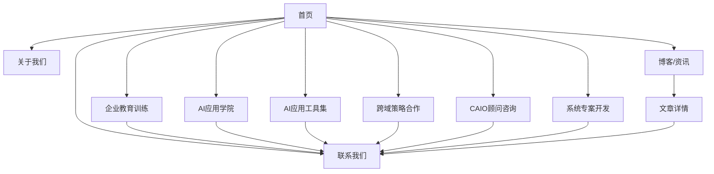

# 瑞比智慧 airabbi 企业官网产品需求文档

## 1. Product Overview
瑞比智慧 airabbi 是一个专注于帮助企业进行 AI 转型的服务平台官网。网站主要展示公司的 AI 转型服务，包括企业教育训练、CAIO 顾问咨询、AI 应用工具集等核心业务。
- 解决中小企业 AI 转型难题，提供从教育训练到技术实施的一站式服务，帮助企业轻松导入 AI 技术。
- 目标是成为台湾企业 AI 转型的最佳合作伙伴，协助企业运用 AI 之力茁壮成国际级企业。

## 2. Core Features

### 2.1 User Roles
本网站主要面向企业客户，无需复杂的用户角色区分：

| Role | Registration Method | Core Permissions |
|------|---------------------|------------------|
| 访客用户 | 无需注册 | 浏览所有内容、查看服务介绍、联系咨询 |
| 潜在客户 | 联系表单提交 | 获取详细服务信息、预约咨询 |

### 2.2 Feature Module
网站需求包含以下主要页面：
1. **首页**：品牌展示区、核心服务介绍、成功案例展示
2. **服务详情页**：六大核心服务的详细介绍页面
3. **关于我们页**：公司介绍、团队信息、获奖记录
4. **联系我们页**：联系方式、咨询表单、地址信息
5. **博客/资讯页**：AI 研究报告、行业资讯展示

### 2.3 Page Details

| Page Name | Module Name | Feature description |
|-----------|-------------|---------------------|
| 首页 | Hero Banner | 展示主标语"瑞比智慧 airabbi 幫助企業 AI 轉型，輕鬆無痛！"，包含动态背景和 CTA 按钮 |
| 首页 | 服务概览区 | 展示六大核心服务卡片：企业教育训练、AI应用学院、AI应用工具集、跨域策略合作、CAIO顾问咨询、系统专案开发 |
| 首页 | 成果展示区 | 展示公司获奖记录和专业认证，包括台大创创加速器、经济部新创事业奖等 |
| 首页 | 最新资讯区 | 展示最新 AI 研究报告和工具介绍，包含"解读《AI 2027》报告"等内容 |
| 首页 | 联系咨询区 | 包含联系表单和"任何 AI 轉型問題都歡迎與我們聊聊！"的 CTA |
| 服务详情页 | 服务介绍 | 详细描述每项服务的内容、优势和适用对象 |
| 服务详情页 | 案例展示 | 展示相关服务的成功案例和客户反馈 |
| 服务详情页 | 咨询按钮 | 提供直接咨询和联系的入口 |
| 关于我们页 | 公司介绍 | 展示公司使命、愿景和发展历程 |
| 关于我们页 | 获奖记录 | 详细展示 2019-2024 年的各项获奖和认证 |
| 联系我们页 | 联系表单 | 包含姓名、邮箱、公司、需求等字段的咨询表单 |
| 联系我们页 | 联系信息 | 展示公司地址、电话、邮箱等联系方式 |
| 博客页 | 文章列表 | 展示 AI 相关的研究报告和行业资讯 |
| 博客页 | 文章详情 | 完整的文章内容展示和分享功能 |

## 3. Core Process

**主要用户操作流程：**

访客进入网站 → 浏览首页了解服务概况 → 点击感兴趣的服务查看详情 → 通过联系表单提交咨询需求 → 等待客服联系跟进

**页面导航流程图：**

## 4. User Interface Design

### 4.1 Design Style
- **主色调**：深蓝色 (#1e3a8a) 和橙色 (#f97316) 作为品牌色
- **辅助色**：白色背景，浅灰色 (#f8fafc) 作为区块分隔
- **按钮样式**：圆角按钮，渐变色彩，悬停效果
- **字体**：中文使用思源黑体，英文使用 Inter 或 Roboto，标题 24-32px，正文 16-18px
- **布局风格**：卡片式设计，顶部导航栏，响应式网格布局
- **图标风格**：线性图标配合实心图标，现代简约风格

### 4.2 Page Design Overview

| Page Name | Module Name | UI Elements |
|-----------|-------------|-------------|
| 首页 | Hero Banner | 全屏背景图片，居中大标题，渐变色 CTA 按钮，动态粒子效果 |
| 首页 | 服务卡片 | 3x2 网格布局，白色卡片阴影效果，图标+标题+描述的结构 |
| 首页 | 成果展示 | 时间轴样式展示获奖记录，左右交替布局 |
| 首页 | 资讯区块 | 卡片式文章预览，包含缩略图、标题、摘要和"继续阅读"链接 |
| 导航栏 | 顶部菜单 | 固定顶部，白色背景，logo 左对齐，菜单项右对齐，悬停下划线效果 |
| 联系表单 | 表单区域 | 简洁的表单设计，输入框圆角边框，提交按钮渐变色 |

### 4.3 Responsiveness
网站采用移动优先的响应式设计，支持桌面端、平板和手机端的完美适配。在移动端优化触摸交互，包括适当的按钮大小和间距。